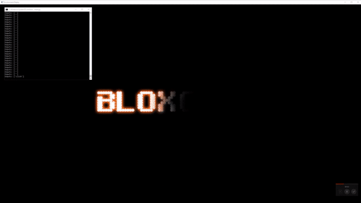

# Environment-Recorder
Captures keystrokes and video from any window for use as a Reinforcement Learning environment.

### Description
- Generates action keys for the visual state of each frame in the environment window
- Captures actions from keyboard and mouse inputs
- Video and action frames are stored independently to mimic common Reinforcement Learning environments
- Replay environment captures (See Examples)
- No noticeable performance loss during recording of environment

# Requirements
- Python
- requirements.txt (included)

# How To Use
In your console, navigate to desired directory and enter the following
- git clone https://github.com/Adriman32/Environment-Recorder.git
- cd Environment-Recorder
- pip install -r requirements.txt

\* NOTE: Currently under development. Project will drastically change as optimizations are implemented. May not work for your system yet.

# Examples
### Bloxors

### Minecraft

### Call of Duty

